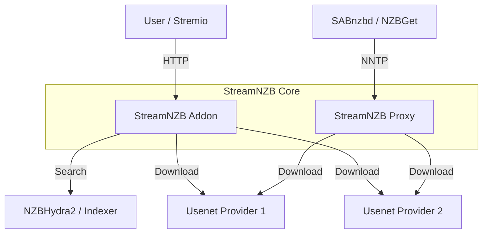

# StreamNZB

[](https://buymeacoffee.com/gaisberg)

StreamNZB is a unified **Stremio Addon** and **Usenet Proxy** that pools multiple providers into a single, high-availability endpoint.

### ✨ Features
*   **Stremio Integration**: Stream content directly from Usenet with availability caching.
*   **Smart Pooling**: Aggregates connections from multiple Usenet providers.
*   **Availability Checking**: Verifies article existence before attempting playback.
*   **NNTP Proxy**: Exposes a standard NNTP server (default port 119) for use with SABnzbd or NZBGet.
*   **Cross-Platform**: Runs on Docker, Windows, Linux, and macOS.

### 🏗️ Architecture



### ✅ Prerequisites
Before running StreamNZB, ensure you have:
1.  **Usenet Provider(s)**: At least one active subscription (e.g., Newshosting, Eweka).
2.  **Indexer / Aggregator**: **NZBHydra2 is required** with your indexers configured.
3.  **Stremio** (Optional): Required if you want to use the streaming capabilities. You can use StreamNZB solely as an NNTP proxy without Stremio.

### 🚀 Running the Application

You can run StreamNZB using Docker or directly as a binary on your system.

#### 1. Docker (Recommended)

**Using Docker Compose:**
```yaml
version: '3.8'

services:
  streamnzb:
    image: ghcr.io/gaisberg/streamnzb:latest
    container_name: streamnzb
    restart: unless-stopped
    ports:
      - "7000:7000"
    environment:
      - NZBHYDRA2_URL=http://nzbhydra2:5076
      - NZBHYDRA2_API_KEY=your_api_key_here
      - ADDON_PORT=7000
      - ADDON_BASE_URL=http://localhost:7000
      - PROVIDER_1_NAME=Provider1
      - PROVIDER_1_HOST=news.provider1.com
      - PROVIDER_1_PORT=563
      - PROVIDER_1_USERNAME=user
      - PROVIDER_1_PASSWORD=password
      - PROVIDER_1_CONNECTIONS=10
      - PROVIDER_1_SSL=true
      - SECURITY_TOKEN=your_secure_token
```

**Using Docker Run:**
```bash
docker run -d \
  --name streamnzb \
  -p 7000:7000 \
  -e NZBHYDRA2_URL=http://your-hydra-url:5076 \
  -e NZBHYDRA2_API_KEY=your_api_key \
  -e ADDON_BASE_URL=http://your-server-ip:7000 \
  ghcr.io/gaisberg/streamnzb:latest
```

#### 2. Windows / Linux / macOS (Binary)

1. **Download**: Get the latest release for your platform from the [Releases Page](https://github.com/Gaisberg/streamnzb/releases).
   - Windows: `streamnzb-windows-amd64.exe`
   - Linux: `streamnzb-linux-amd64` (or `arm64`)
   
2. **Configure**: 
   - Download the `.env.example` file and save it as `.env` in the same directory as the binary.
   - Open `.env` with a text editor and fill in your details (Provider settings, API keys, etc).

3. **Run**:
   - **Windows**: Double-click `streamnzb.exe` or run in PowerShell:
     ```powershell
     .\streamnzb-windows-amd64.exe
     ```
   - **Linux/macOS**:
     ```bash
     chmod +x streamnzb-linux-amd64
     ./streamnzb-linux-amd64
     ```

### Configuration

Configuration is handled via environment variables or the `.env` file. See `.env.example` for all available options.

**Key Settings:**
- `NZBHYDRA2_*`: Connection to your indexer (Hydra2 recommended).
- `PROVIDER_*`: Your Usenet provider details. You can add multiple providers by incrementing the number (PROVIDER_1, PROVIDER_2, etc).
- `ADDON_BASE_URL`: The public URL where Stremio can reach this service.
- `SECURITY_TOKEN`: Optional but recommended. Adds a path prefix to your addon URL to prevent unauthorized access.

### ❓ Troubleshooting

**"No streams were found" in Stremio**
- Ensure `NZBHYDRA2_URL` and API Key are correct.
- Check if your Usenet providers are active.
- Verify that `VALIDATION_SAMPLE_SIZE` is not too high (checking too many articles can timeout).

**Connection Refused on Port 119**
- Linux often requires `sudo` to bind to port 119.
- Change `NNTP_PROXY_PORT` to `1119` or similar if running without root.

**Slow Downloads / Buffering**
- Increase `MAX_CONCURRENT_VALIDATIONS`.
- Ensure your server has sufficient bandwidth.
- Check `CACHE_TTL_SECONDS` to reduce repeated availability checks.

### ☕ Support

If you find this project useful and want to support its development, you can buy me a coffee:

[**Buy Me A Coffee**](https://buymeacoffee.com/gaisberg)

### 📜 Credits

This project incorporates logic and packages for archive decoding (RAR and 7z) from the [altmount](https://github.com/javi11/altmount) project by [javi11](https://github.com/javi11). Special thanks for the robust implementation of on-the-fly Usenet archive extraction.
