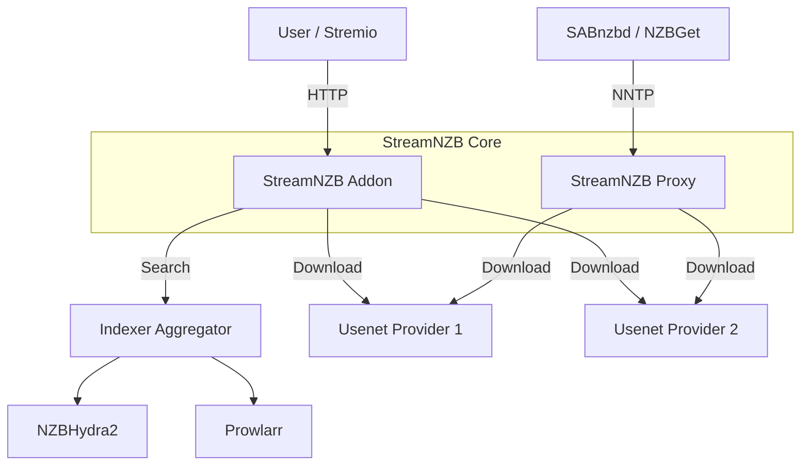

# StreamNZB

[](https://buymeacoffee.com/gaisberg)
[](https://snzb.stream/discord)

StreamNZB is a unified **Stremio Addon** and **Usenet Proxy** that pools multiple providers into a single, high-availability endpoint.

### ✨ Features
*   **Stremio Integration**: Stream content directly from Usenet with availability caching.
*   **AvailNZB**: Optional integration with the [AvailNZB](https://check.snzb.stream) community availability database for faster stream discovery and shared health reports.
*   **Multiple Indexers**: Supports **NZBHydra2** and **Prowlarr** with parallel search aggregation.
*   **Smart Pooling**: Aggregates connections from multiple Usenet providers.
*   **Availability Checking**: Verifies article existence before attempting playback.
*   **NNTP Proxy**: Exposes a standard NNTP server (default port 119) for use with SABnzbd or NZBGet.
*   **Admin Authentication**: Secure admin login with password protection and session management.
*   **Device Management**: Create multiple device accounts, each with their own Stremio manifest URL and customizable filters/sorting.
*   **Per-Device Configuration**: Each device can have custom quality filters, codec preferences, and sorting rules.
*   **Cross-Platform**: Runs on Docker, Windows, Linux, and macOS.

### 🏗️ Architecture



### ✅ Prerequisites
Before running StreamNZB, ensure you have:
1.  **Usenet Provider(s)**: At least one active subscription (e.g., Newshosting, Eweka).
2.  **Indexer Manager**: **NZBHydra2** OR **Prowlarr** (or both!) with your indexers configured.
3.  **Stremio** (Optional): Required if you want to use the streaming capabilities. You can use StreamNZB solely as an NNTP proxy without Stremio.

### 🚀 Running the Application

You can run StreamNZB using Docker or directly as a binary on your system.

#### 1. Docker (Recommended)

**Using Docker Compose:**
```yaml
services:
  streamnzb:
    image: ghcr.io/gaisberg/streamnzb:latest
    container_name: streamnzb
    restart: unless-stopped
    ports:
      - "7000:7000"
      - "119:119"
    volumes:
      - /path/to/config:/app/data
```

Alternatively you can set environment variables to configure the application on first startup, check .env.example for available variables.

#### 2. Windows / Linux / macOS (Binary)

1. **Download**: Get the latest release for your platform from the [Releases Page](https://github.com/Gaisberg/streamnzb/releases).
2. **Run**: Start the binary.

### ⚙️ Getting started

1. Once you've got StreamNZB running, you can access the web UI at `http://localhost:7000`.

2. **First-time Setup**: On first launch, StreamNZB creates a default admin account:
   - **Username**: `admin`
   - **Password**: `admin`
   - ⚠️ **Important**: You will be prompted to change this password on first login for security.
   - This admin account is used to access the web dashboard and manage devices.

3. **Accessing the Dashboard**: 
   - Log in with your admin credentials
   - The dashboard provides real-time statistics, provider status, and system logs
   - Use the **Settings** icon to configure providers, indexers, filters, and devices

4. **Device Management**:
   - Navigate to **Settings → Devices** tab
   - Create device accounts for different users or Stremio installations
   - Each device gets a unique token and manifest URL
   - Devices can have custom filters and sorting preferences
   - Copy the manifest URL for each device to add it to Stremio

5. **Configuration**:
   - You need at least one **Usenet Provider** and one **Indexer** to get started
   - Configure providers in **Settings → Providers**
   - Configure indexers in **Settings → Indexers** (supports NZBHydra2, Prowlarr, and internal indexers)
   - Set global filters and sorting in **Settings → Filters** and **Settings → Sorting**

### 📊 AvailNZB (Community availability database)

StreamNZB can use **[AvailNZB](https://check.snzb.stream)** to speed up stream discovery and contribute to a shared availability database:

- **What it does**: When enabled, StreamNZB checks AvailNZB for releases that others have already verified, so you can get playable streams without re-validating every release. It also reports success/failure for your providers so the database stays up to date.
- **Where to find it**: [https://check.snzb.stream](https://check.snzb.stream)

> [!TIP]
> Use **Device Management** (Settings → Devices) to create separate accounts for different users or Stremio installations. Each device gets its own token and can have custom filters and sorting preferences.

### 🔐 Authentication & Devices

**Admin Account**
- The admin account is created on first launch
- Admin password can be changed in **Settings → General → Admin Password**
- Admin session tokens persist across browser sessions (stored in localStorage)
- Admin manifest URL is displayed in **Settings → General** (uses admin session token)

**Device Accounts**
- Create device accounts in **Settings → Devices**
- Each device gets a unique token for accessing Stremio
- Device tokens are permanent and don't expire
- Each device can have custom filters and sorting preferences
- Device manifest URLs follow the format: `{baseUrl}/{deviceToken}/manifest.json`
- Regenerate device tokens if compromised
- Delete devices when no longer needed

**Security**
- Admin accounts require password authentication
- Device tokens provide secure access to Stremio without exposing admin credentials
- Use device tokens instead of sharing admin credentials

### ❓ Troubleshooting

**"No streams were found" in Stremio**
- Ensure your indexer URLs and API keys are correct in **Settings → Indexers**
- Check if your Usenet providers are active and connected
- Verify that `Validation Sample Size` is not too high (checking too many articles can timeout)
- Check device-specific filters in **Settings → Devices** - they may be blocking results

**Slow Downloads**
- Ensure your system has sufficient bandwidth
- Check provider connection limits in **Settings → Providers**

## Troubleshooting Playback Issues
**Why am I seeing a "Stream Unavailable" video instead of my movie?**
A failure video plays when StreamNZB cannot play the selected content. Common causes:
### Archive Issues
- ❌ **Compressed archive** - Only uncompressed (STORE mode) archives work
  - *Solution:* Try a different release or uploader
- ❌ **Password-protected** - Encrypted archives aren't supported
  - *Solution:* Avoid password-protected releases
- ❌ **No video files** - Archive contains only samples/extras
  - *Solution:* Verify NZB contents, select different result
### Usenet Issues  
- ❌ **Missing articles** - Content expired or incomplete
  - *Solution:* Try newer release or add more providers
- ❌ **Provider offline** - NNTP server unreachable
  - *Solution:* Check provider status, verify credentials
- ❌ **Connection limit** - Too many concurrent connections
  - *Solution:* Reduce connection count in config
### Network Issues
- ❌ **Download errors** - Network interruption or corrupted data
  - *Solution:* Retry playback or try different provider
- ❌ **Timeout** - Very large archive taking too long to scan
  - *Solution:* Try smaller release
**Tip:** Check the logs (Settings → Logs) for specific error messages.

### ☕ Support

If you find this project useful and want to support its development, you can buy me a coffee:

[**Buy Me A Coffee**](https://buymeacoffee.com/gaisberg)

### 🛡️ Privacy & Community
[AvailNZB](https://check.snzb.stream) is configured for official releases, to opt out build the binary yourself.

### 📜 Credits

This project incorporates logic and packages for archive decoding (RAR and 7z) from the [altmount](https://github.com/javi11/altmount) project by [javi11](https://github.com/javi11). Special thanks for the robust implementation of on-the-fly Usenet archive extraction.


[](https://app.koyeb.com/deploy?name=streemnzb&type=docker&image=ghcr.io%2Fgaisberg%2Fstreamnzb%3Av1.2.0&instance_type=free&regions=fra&instances_min=0&autoscaling_sleep_idle_delay=3900&env%5BADDON_BASE_URL%5D=https%3A%2F%2Fstrange-romola-helpyourself-63612162.koyeb.app&env%5BADDON_PORT%5D=7000&env%5BCACHE_TTL_SECONDS%5D=3600&env%5BLOG_LEVEL%5D=DEBUG&env%5BMAX_CONCURRENT_VALIDATIONS%5D=5&env%5BNNTP_PROXY_AUTH_PASS%5D=usenet&env%5BNNTP_PROXY_AUTH_USER%5D=usenet&env%5BNNTP_PROXY_ENABLED%5D=true&env%5BNNTP_PROXY_HOST%5D=0.0.0.0&env%5BNNTP_PROXY_PORT%5D=119&env%5BPASSWORD%5D=JPh7v6A4YNoO193SgXr8Z2kjxFWp50Gz&env%5BPROVIDER_1_CONNECTIONS%5D=50&env%5BPROVIDER_1_HOST%5D=news.newshosting.com&env%5BPROVIDER_1_NAME%5D=Newshosting&env%5BPROVIDER_1_PASSWORD%5D=qyj4dfr*fqc9yvy7XHK&env%5BPROVIDER_1_PORT%5D=563&env%5BPROVIDER_1_SSL%5D=true&env%5BPROVIDER_1_USERNAME%5D=kpauly2&env%5BPROVIDER_2_CONNECTIONS%5D=20&env%5BPROVIDER_2_HOST%5D=news.eweka.nl&env%5BPROVIDER_2_NAME%5D=Eweka&env%5BPROVIDER_2_PASSWORD%5D=6fKaQCF%5Ehlg4&env%5BPROVIDER_2_PORT%5D=563&env%5BPROVIDER_2_SSL%5D=true&env%5BPROVIDER_2_USERNAME%5D=dbe0f771e476da32&env%5BPROVIDER_HEADER%5D=VLC%2F1.2.3.4&env%5BTMDB_API_KEY%5D=f051e7366c6105ad4f9aafe4733d9dae&env%5BTVDB_API_KEY%5D=e0936ab0-73b9-41ce-8e6f-028eb1997057&env%5BTZ%5D=Europe%2FHelsinki&env%5BVALIDATION_SAMPLE_SIZE%5D=5&ports=7000%3Bhttp%3B%2F&hc_protocol%5B7000%5D=tcp&hc_grace_period%5B7000%5D=5&hc_interval%5B7000%5D=30&hc_restart_limit%5B7000%5D=3&hc_timeout%5B7000%5D=5&hc_path%5B7000%5D=%2F&hc_method%5B7000%5D=get)
