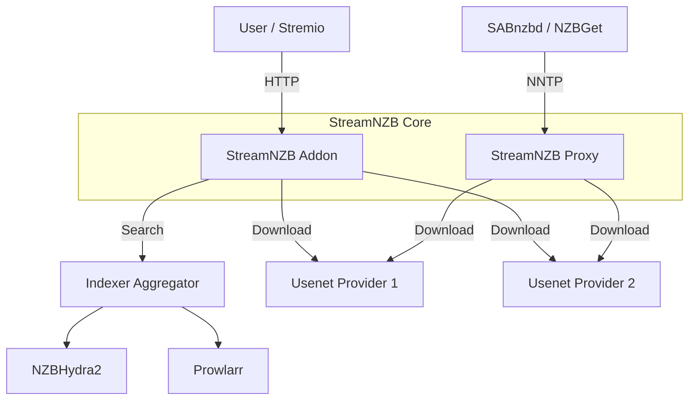

# StreamNZB

[](https://buymeacoffee.com/gaisberg)

StreamNZB is a unified **Stremio Addon** and **Usenet Proxy** that pools multiple providers into a single, high-availability endpoint.

### ✨ Features
*   **Stremio Integration**: Stream content directly from Usenet with availability caching.
*   **Multiple Indexers**: Supports **NZBHydra2** and **Prowlarr** with parallel search aggregation.
*   **Smart Pooling**: Aggregates connections from multiple Usenet providers.
*   **Availability Checking**: Verifies article existence before attempting playback.
*   **NNTP Proxy**: Exposes a standard NNTP server (default port 119) for use with SABnzbd or NZBGet.
*   **Cross-Platform**: Runs on Docker, Windows, Linux, and macOS.

### 🏗️ Architecture



### ✅ Prerequisites
Before running StreamNZB, ensure you have:
1.  **Usenet Provider(s)**: At least one active subscription (e.g., Newshosting, Eweka).
2.  **Indexer Manager**: **NZBHydra2** OR **Prowlarr** (or both!) with your indexers configured.
3.  **Stremio** (Optional): Required if you want to use the streaming capabilities. You can use StreamNZB solely as an NNTP proxy without Stremio.

### 🚀 Running the Application

You can run StreamNZB using Docker or directly as a binary on your system.

#### 1. Docker (Recommended)

**Using Docker Compose:**
```yaml
services:
  streamnzb:
    image: ghcr.io/gaisberg/streamnzb:latest
    container_name: streamnzb
    restart: unless-stopped
    ports:
      - "7000:7000"
      - "1119:1119"
    volumes:
      - /path/to/config:/app/data
```

Alternatively you can set environment variables to configure the application on first startup, check .env.example for available variables.

#### 2. Windows / Linux / macOS (Binary)

1. **Download**: Get the latest release for your platform from the [Releases Page](https://github.com/Gaisberg/streamnzb/releases).
2. **Run**: Start the binary.

### ⚙️ Getting started

1. Once you've got StreamNZB running, you can access the web UI at `http://localhost:7000` or `http://localhost:7000/mysecret/` if you've set a security token.

> [!TIP]
> Use the **Security Token** to secure your instance when exposing it to the internet.

2. Click the **Settings** icon in the dashboard to configure everything visually.

3. You need at least one **Usenet Provider** and one **Indexer** to get started.

### ❓ Troubleshooting

**"No streams were found" in Stremio**
- Ensure `NZBHYDRA2_URL` and API Key are correct.
- Check if your Usenet providers are active.
- Verify that `VALIDATION_SAMPLE_SIZE` is not too high (checking too many articles can timeout).

**Connection Refused on Port 119**
- Linux often requires `sudo` to bind to port 119.
- Change `NNTP_PROXY_PORT` to `1119` or similar if running without root.

**Slow Downloads**
- Increase `MAX_CONCURRENT_VALIDATIONS`.
- Ensure your system has sufficient bandwidth.

**Why am I seeing Big Buck Bunny instead of my movie?**
- If you're seeing Big Buck Bunny, it means streamNZB was unable to play movie from Usenet and you should try another one.

### ☕ Support

If you find this project useful and want to support its development, you can buy me a coffee:

[**Buy Me A Coffee**](https://buymeacoffee.com/gaisberg)

### 🛡️ Privacy & Community
Official builds automatically submit anonymous availability status reports to a community database to help improve global retention accuracy. To opt-out of this reporting, please build the binary from source.

### 📜 Credits

This project incorporates logic and packages for archive decoding (RAR and 7z) from the [altmount](https://github.com/javi11/altmount) project by [javi11](https://github.com/javi11). Special thanks for the robust implementation of on-the-fly Usenet archive extraction.
