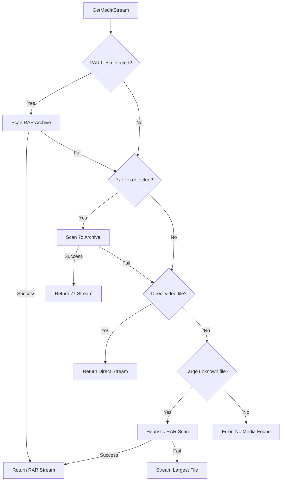
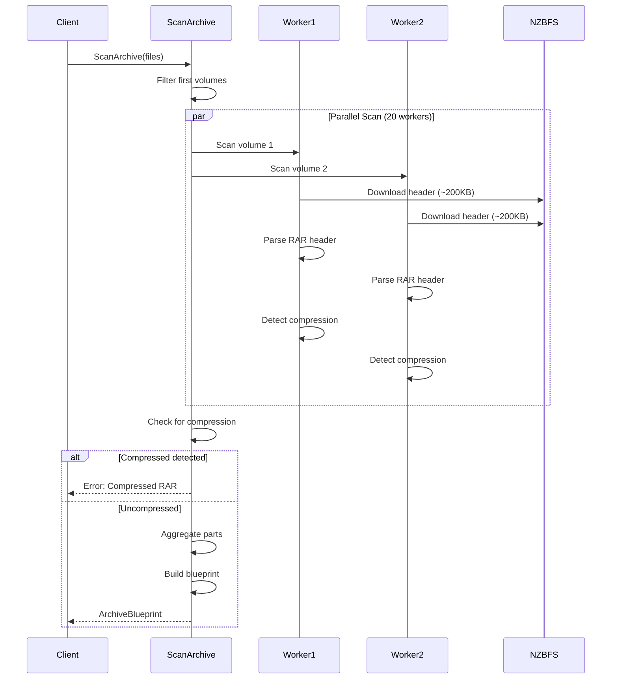

# Archive Streaming Architecture

This document provides a comprehensive overview of how StreamNZB handles different archive formats and streams media files directly from Usenet without full extraction.

## Overview

StreamNZB supports streaming video files from various archive formats by creating **virtual streams** that read data on-demand from Usenet articles. The system is designed to work with:

- **RAR archives** (uncompressed only)
- **7-Zip archives** (uncompressed only)  
- **Direct video files** (MKV, MP4, AVI)
- **Obfuscated files** (heuristic detection)

## Supported File Types

### Video Extensions
- `.mkv` - Matroska Video
- `.mp4` - MPEG-4 Video
- `.avi` - Audio Video Interleave

### Archive Extensions
- `.rar` - RAR Archive (single or multi-volume)
- `.part01.rar`, `.part02.rar`, etc. - Multi-part RAR
- `.r00`, `.r01`, `.r02`, etc. - Old-style RAR volumes
- `.7z` - 7-Zip Archive
- `.7z.001`, `.7z.002`, etc. - Multi-volume 7-Zip
- `.z01`, `.z02`, etc. - Split archives (Zip/7z)
- `.001`, `.002`, etc. - Generic split archives

### Excluded Extensions
- `.par2` - Parity files (skipped)
- `.nfo` - Info files (skipped)
- `.nzb` - NZB metadata (skipped)

## Media Detection Flow

The `GetMediaStream()` function in [`archive.go`](file:///d:/Kappe/Git/streamnzb/pkg/unpack/archive.go) implements a **waterfall strategy** to find playable media:



### Detection Priority

1. **RAR Archives** - Checked first (most common format)
2. **7-Zip Archives** - Checked if no RAR found
3. **Direct Video Files** - Uncompressed video files
4. **Heuristic Detection** - For obfuscated/unknown files >50MB

## RAR Archive Streaming

### Architecture

RAR streaming uses a **parallel header scanning** approach inspired by NZBDav:

1. **Identify RAR volumes** - Find all `.rar`, `.part*.rar`, `.r00-r99`, `.z01-z99` files
2. **Parallel scan** - Scan headers of all volumes concurrently (20 workers max)
3. **Aggregate parts** - Combine data segments for the main video file
4. **Create VirtualStream** - Build seekable stream from segments

### Blueprint Pattern

RAR archives use an **ArchiveBlueprint** for caching:

```go
type ArchiveBlueprint struct {
    MainFileName string           // e.g. "movie.mkv"
    TotalSize    int64            // Total uncompressed size
    Parts        []VirtualPartDef // Data segment mappings
    IsCompressed bool             // Compression detection flag
}
```

The blueprint is created on first access and can be cached to avoid re-scanning headers on subsequent requests (e.g., VLC retries).

### VirtualStream Implementation

The [`VirtualStream`](file:///d:/Kappe/Git/streamnzb/pkg/unpack/virtual_stream.go) provides a seekable `io.ReadSeekCloser` interface:

```go
type virtualPart struct {
    VirtualStart int64          // Offset in virtual file
    VirtualEnd   int64          // End offset in virtual file
    VolFile      UnpackableFile // Physical RAR volume
    VolOffset    int64          // Offset within volume
}
```

**Key Features:**
- **Seek support** - Required for video players (VLC, MPV, etc.)
- **On-demand reading** - Only downloads needed segments from Usenet
- **Background worker** - Prefetches data in chunks
- **Multi-volume** - Seamlessly spans across RAR volumes

### Compression Detection

**CRITICAL:** Only **uncompressed (STORE mode)** RAR archives are supported for streaming.

Compression is detected by comparing packed vs unpacked sizes:

```go
isCompressed := packedSize < (unpackedSize * 95 / 100)  // 5% tolerance for headers
```

**Detection happens:**
1. During parallel scan - Each volume checks its file entries
2. After scan completes - Early check before building blueprint
3. On stream creation - Final validation in `StreamFromBlueprint()`

**Why compression isn't supported:**
- Requires sequential decompression (no seeking)
- Video players need random access for playback
- Would require full download + decompression (defeats streaming purpose)

### RAR Volume Types

The system handles multiple RAR naming conventions:

| Pattern | Example | Description |
|---------|---------|-------------|
| `.rar` | `movie.rar` | Single-volume or first volume |
| `.part01.rar` | `movie.part01.rar` | Modern multi-part naming |
| `.r00`, `.r01` | `movie.r00`, `movie.r01` | Old-style RAR volumes |
| `.z01`, `.z02` | `movie.z01`, `movie.z02` | Split archive format |
| `.001`, `.002` | `movie.001`, `movie.002` | Generic split format |

**First Volume Detection:**
- `.rar` (without `.part` in name)
- `.part1.rar`, `.part01.rar`, `.part001.rar`
- `.r00`
- `.z01`, `.001`

**Middle Volume Detection** (skipped during scan):
- `.part02.rar`, `.part03.rar`, etc.
- `.r01`, `.r02`, etc. (except `.r00`)

### Scan Process



**Performance:**
- **Parallel scanning** - 20 concurrent workers
- **Header-only** - Downloads ~200KB per volume (not full file)
- **Typical time** - 5-7 seconds for 23-volume archive
- **Compression check** - Happens after scan completes

## 7-Zip Archive Streaming

### Architecture

7-Zip streaming uses a **ConcatenatedReaderAt** approach:

1. **Identify 7z files** - Find `.7z` or `.7z.001` files
2. **Parse central directory** - Read 7z metadata
3. **Locate video file** - Find largest video file in archive
4. **Map file offset** - Calculate physical volume positions
5. **Create concatenated reader** - Combine volumes into single `ReaderAt`

### Blueprint Pattern

```go
type SevenZipBlueprint struct {
    MainFileName string         // e.g. "movie.mkv"
    TotalSize    int64          // Uncompressed size
    FileOffset   int64          // Offset in concatenated volumes
    Files        []*loader.File // Physical 7z volumes
}
```

### ConcatenatedReaderAt

The [`ConcatenatedReaderAt`](file:///d:/Kappe/Git/streamnzb/pkg/unpack/sevenzip.go#L281-L284) provides random access across multiple volumes:

```go
type Part struct {
    Reader io.ReaderAt  // Volume reader
    Offset int64        // Start offset in concatenated view
    Size   int64        // Part size
}
```

**Key Features:**
- **Random access** - Implements `io.ReaderAt` for seeking
- **Multi-volume** - Transparently spans `.7z.001`, `.7z.002`, etc.
- **Efficient** - Only reads requested byte ranges

### Compression Detection

Like RAR, **only uncompressed 7z archives** are supported:

```go
if file.Method != sevenzip.Store {
    return nil, fmt.Errorf("compressed 7z not supported")
}
```

The 7z library provides the compression method directly from metadata.

### 7z vs RAR Differences

| Feature | RAR | 7-Zip |
|---------|-----|-------|
| **Scan Strategy** | Parallel header scan | Single central directory |
| **Stream Type** | VirtualStream | sevenzip.ReadCloser |
| **Reader Type** | io.ReadSeekCloser | io.ReaderAt wrapper |
| **Volume Detection** | Complex patterns | Simple `.7z.001` sequence |
| **Compression Check** | Size comparison | Method field |

## Direct Video Streaming

For **uncompressed video files** (`.mkv`, `.mp4`, `.avi`):

```go
stream, err := file.OpenStream()
return stream, filename, size, nil, nil
```

**Advantages:**
- No archive overhead
- Instant streaming
- No header scanning required

**Use Case:**
- Scene releases sometimes post raw MKV files
- Smaller files that don't need compression

## Obfuscated File Handling

For files with **unknown or obfuscated names**:

1. **Find largest file** - Exclude `.rar`, `.par2`, `.nfo`, `.nzb`
2. **Size threshold** - Must be >50MB
3. **Heuristic RAR scan** - Attempt to detect RAR by magic bytes
4. **Fallback** - Stream largest file directly if scan fails

**Example:**
```
"random_name_12345.bin" (4.5GB)
```

The system will:
1. Detect it's the largest file
2. Attempt RAR header scan
3. If RAR detected → Use VirtualStream
4. If not RAR → Stream directly as video

## Error Handling

### Compressed Archive Detection

When a compressed archive is detected:

```
ERROR: compressed RAR archives are not supported for streaming (file: movie.mkv). 
       The archive must use STORE mode (0% compression) for streaming to work
```

**User Impact:**
- Error appears after 5-7 second scan
- VLC may retry automatically (causing double scan)
- User should select different release (uncompressed)

**Why it happens:**
- Some uploaders use compression to save bandwidth
- ~5% of RAR releases are compressed
- Streaming requires random access (incompatible with compression)

### No Media Found

```
ERROR: GetMediaStream found no suitable media
```

**Causes:**
- No video files in archive
- All files are compressed
- Archive is corrupted
- Wrong file type (e.g., audio-only)

## Performance Characteristics

### RAR Streaming

| Operation | Time | Bandwidth |
|-----------|------|-----------|
| Header scan (23 volumes) | 5-7s | ~4.6MB |
| First byte latency | <1s | ~384KB |
| Seek operation | <500ms | ~384KB |
| Continuous playback | Real-time | Bitrate-dependent |

### 7z Streaming

| Operation | Time | Bandwidth |
|-----------|------|-----------|
| Central directory read | 1-2s | <1MB |
| First byte latency | <1s | ~384KB |
| Seek operation | <500ms | ~384KB |

### Direct Video

| Operation | Time | Bandwidth |
|-----------|------|-----------|
| Stream open | <100ms | 0 |
| First byte latency | <500ms | ~384KB |

## Blueprint Caching

Blueprints can be cached to avoid re-scanning:

```go
// First request - creates blueprint
stream, name, size, blueprint, err := GetMediaStream(files, nil)

// Subsequent requests - reuses blueprint
stream2, name2, size2, _, err := GetMediaStream(files, blueprint)
```

**Benefits:**
- **VLC retries** - No double scan on error
- **Multiple sessions** - Faster subsequent plays
- **Seek operations** - No re-scanning needed

**Cache Duration:**
- Typically session-based (30 minutes)
- Stored in memory
- Invalidated on NZB change

## Code Structure

### Key Files

| File | Purpose |
|------|---------|
| [`archive.go`](file:///d:/Kappe/Git/streamnzb/pkg/unpack/archive.go) | Main entry point, format detection |
| [`rar.go`](file:///d:/Kappe/Git/streamnzb/pkg/unpack/rar.go) | RAR scanning, blueprint creation |
| [`sevenzip.go`](file:///d:/Kappe/Git/streamnzb/pkg/unpack/sevenzip.go) | 7z scanning, concatenated reader |
| [`virtual_stream.go`](file:///d:/Kappe/Git/streamnzb/pkg/unpack/virtual_stream.go) | Seekable stream implementation |
| [`file_utils.go`](file:///d:/Kappe/Git/streamnzb/pkg/unpack/file_utils.go) | Extension detection, filename parsing |
| [`types.go`](file:///d:/Kappe/Git/streamnzb/pkg/unpack/types.go) | UnpackableFile interface |

### Key Functions

| Function | Purpose |
|----------|---------|
| `GetMediaStream()` | Main entry point for all formats |
| `ScanArchive()` | Parallel RAR header scanning |
| `StreamFromBlueprint()` | Create VirtualStream from blueprint |
| `CreateSevenZipBlueprint()` | Parse 7z metadata |
| `Open7zStreamFromBlueprint()` | Create 7z stream from blueprint |
| `IsVideoFile()` | Check for video extensions |
| `IsFirstRarVolume()` | Detect first RAR volume |

## Dependencies

### External Libraries

- **`github.com/javi11/rardecode/v2`** - RAR header parsing
- **`github.com/javi11/sevenzip`** - 7z archive reading

### Internal Packages

- **`streamnzb/pkg/loader`** - NZB file abstraction
- **`streamnzb/pkg/logger`** - Structured logging

## Future Enhancements

### Potential Improvements

1. **Context Cancellation** - Abort RAR scan on first compressed volume detected
2. **Smart Caching** - Persist blueprints to disk for faster restarts
3. **Parallel 7z** - Multi-threaded 7z parsing
4. **ZIP Support** - Add ZIP archive streaming
5. **Compression Streaming** - Experimental decompression-on-the-fly (complex)

### Known Limitations

1. **Compressed archives** - Not supported (by design)
2. **Nested archives** - RAR inside RAR not supported
3. **Encrypted archives** - No password support
4. **Damaged archives** - No repair capability
5. **ISO files** - Not currently parsed (treated as video)

## Debugging

### Useful Log Messages

```
level=INFO msg="Detected RAR archive" volumes=23
level=DEBUG msg="Scanning RAR first volumes" count=23 total=23
level=INFO msg="Scan complete" files=23 duration=5.7s
level=WARN msg="Detected compressed RAR archive - streaming not supported"
level=ERROR msg="StreamFromBlueprint failed" err="compressed RAR..."
```

### Common Issues

**Issue:** "Compressed RAR not supported"
- **Cause:** Archive uses compression
- **Solution:** Find uncompressed release

**Issue:** "No suitable media found"
- **Cause:** No video files in NZB
- **Solution:** Verify NZB contents

**Issue:** VLC retries causing double scan
- **Cause:** VLC automatic retry on error
- **Solution:** Normal behavior, second attempt also fails quickly

## Conclusion

StreamNZB's archive streaming architecture provides efficient, on-demand video playback from Usenet without full extraction. The system intelligently handles multiple archive formats, detects compression early, and creates seekable virtual streams that work seamlessly with standard video players.

The **blueprint pattern** enables caching for performance, while the **waterfall detection strategy** ensures maximum compatibility with various release formats and naming conventions.
